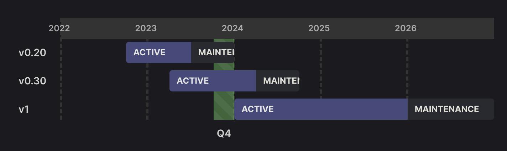
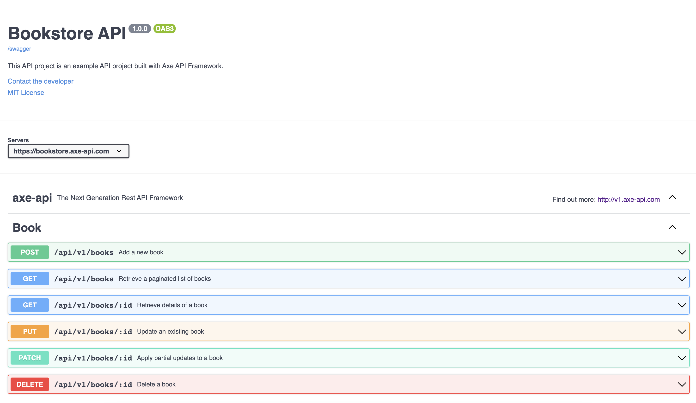

# Axe API v1.0 is out!

`v1.0` is the most important major release in all of Axe API history ever made. Not just because the Axe API is more mature, but also is started to support many great features.

Let's discover it more!

## Long-term support (LTS)

LTS stands for Long-Term Support. It designates software versions with extended stability, security updates, and maintenance, ensuring reliable performance over an extended period, typically several years.

Axe API v1 is an LTS release. Which means it will be supported for 3 years at least.



## Goodbye Express.js!

Axe API started to work on the [http](https://nodejs.org/api/http.html) module now.

The main reason for the [Express.js](https://expressjs.com/) -> [http](https://nodejs.org/api/http.html) change is to improve the performance and the confusion. Axe API is a standalone framework now. This means that Axe API's future is not dependent on [Express.js](https://expressjs.com/)' future anymore.

[Express.js](https://expressjs.com/) was a great choice in the beginning because of its development speed. But it is time to say good bye.

## New logger: pino

Axe API didn't have strong logging features and it was a big issue for a very long time. Axe API team has added the [pino](https://getpino.io/) to the Axe API project as default.

You can configure it according to your wishes!


:::tip
Check the [Pino Configuration](/reference/pino-logger-configs)
:::

## Swagger support

Axe API was supporting the auto-created documentation in the last couple of months. The problem was using a custom design was increasing the learning curve.

Because of that issue, the Axe API team has added the [Swagger-based](https://swagger.io/) documentation. Axe API generates the swagger definitions automatically. But also it provides an endpoint that you can see the documentation directly.



:::tip

You can check a [live example here](https://bookstore.axe-api.com/docs).
:::

## Auto-caching

Axe API has started to provide an auto-caching mechanism with the new version. This means, as a developer you don't need to manage the whole caching strategies for your endpoint. You can provide great caching support for your API by changing simple configurations.

> Axe API uses Redis as the cache database.

Axe API allows developers to define different cache configurations at the application level, version level, model level, and handler level.

You can use the following configurations to support auto-caching features for all endpoints.

::: code-group

```ts [app/config.ts]
import { IApplicationConfig, CacheStrategies } from "axe-api";

const config: IApplicationConfig = {
  // ...
  redis: {
    url: "redis://127.0.0.1:6379",
  },
  cache: {
    enable: true,
    ttl: 300,
    invalidation: CacheStrategies.TimeBased,
  },
  // ...
};
```

:::

After this configuration, all GET handlers (PAGINATE, ALL, and SHOW) will be cached automatically.

:::tip
Check the [Auto-caching](/learn/caching) docs.
:::

## Full-text search

Axe API supports the `LIKE` keyword on database queries. The it can be slow because it performs a sequential scan, checking each record for a match. Unlike indexes that optimize searches, `LIKE` scans entire columns, causing slowdowns with large datasets.

Use full-text indexes or other techniques for better performance in complex searches.

Axe API supports only [Elasticsearch](https://www.elastic.co).

You can activate the **full-text search** feature for each of your models separately by defining which fields should be indexed.

You should use the `search` getter to define which field values should be indexed on Elasticsearch.

::: code-group

```ts{10-12} [app/v1/Models/User.ts]
import { Model } from "axe-api";

class User extends Model {
  // Which fields should be able to filled by HTTP clients
  get fillable() {
    return ["name", "surname", "email", "phone", "address"];
  }

  // Which fields should be indexed on Elasticsearch
  get search() {
    return ["name", "surname", "address"];
  }
}

export default User;
```

:::

After the model definition, Axe API creates an index on Elasticsearch by using the model name.

Also, Axe API _creates_, _updates_, and _deletes_ the data on the index automatically.

All indexes will be generated `automatically` by Axe API in the _initialization process_ if the index is not generated yet.

You can add the [SEARCH](/reference/handlers-search-handler) handler to your API endpoints. In that endpoint, you can run a full-text search on the Elasticsearch index for the related model.

The [SEARCH](/reference/handlers-search-handler) handler will be documented automatically on the [Swagger documentation](/learn/documentation).

After Axe API fetches the related data from Elasticsearch, it uses the primary key values to fetch the original record from the database.

This technique allows you to decide what kind of data should be fetched from API. For example, even though you haven't added a field value called `phone` to the Elasticsearch index, you can see that data on the result. Or, you can select only specific fields by using the `field` query parameter. The best news is you can fetch any relational data by using the `with` query feature.

:::tip
Check the [Full-text search](/learn/full-text-search) docs.
:::

## What's next?

You can use the [Upgrading Guide](/upgrading/v1) here to upgrade your legacy Axe API applications.

You can create an issue if you have any problems.

https://github.com/axe-api/axe-api/issues
