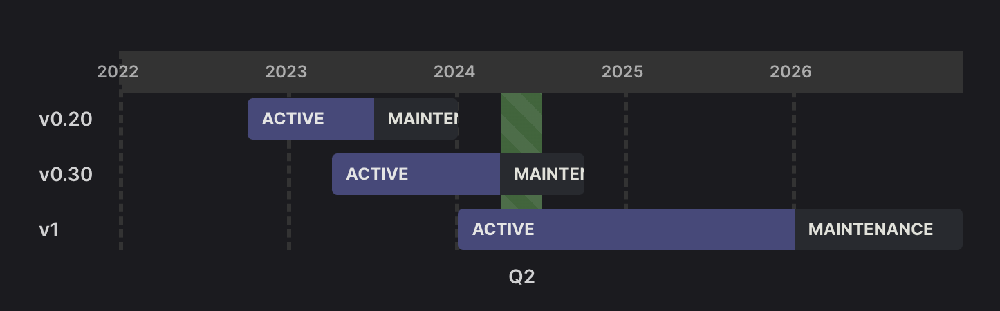

# Axe API v1.3 is out!

`v1.3` comes with one feature and a security upgrades.

Let's discover it more!

## `index.ts` file for hook functions

Hooks and events are a crucial part of Axe API. It allows you to add your application logic to your API in a very efficient and testable way. In this section, we will cover the logic of it.

A simple hook or event function look like the following example;

::: code-group

```ts [app/v1/Hooks/User/onBeforeInsert.ts]
import { IContext } from "axe-api";

export default async (context: IContext) => {
  // add your custom logic in here
};
```

:::

Developers had to put hook functions to separate files. It was useful if your logic is too complicated.

Now developers can put hook functions to `index.ts` file directly. Also, they can use the separated file method at the same time.

::: code-group

```ts [app/v1/Hooks/User/index.ts]
import { IContext } from "axe-api";

export const onBeforeInsert = async (context: IContext) => {
  // add your custom logic in here
};

export const onAfterInsert = async (context: IContext) => {
  // add your custom logic in here
};
```

:::

## `v0.30` is in the maintenance

The maintenance period has begun for the `v0.30` version of Axe API. It will reach EOL at the end of Q3 2024.



You can find the details in the [Versioning Policy
](/upgrading/versioning-policy.html).

You can use the [Upgrading to v1](/upgrading/v1.html) tutorial to upgrade your APIs.
