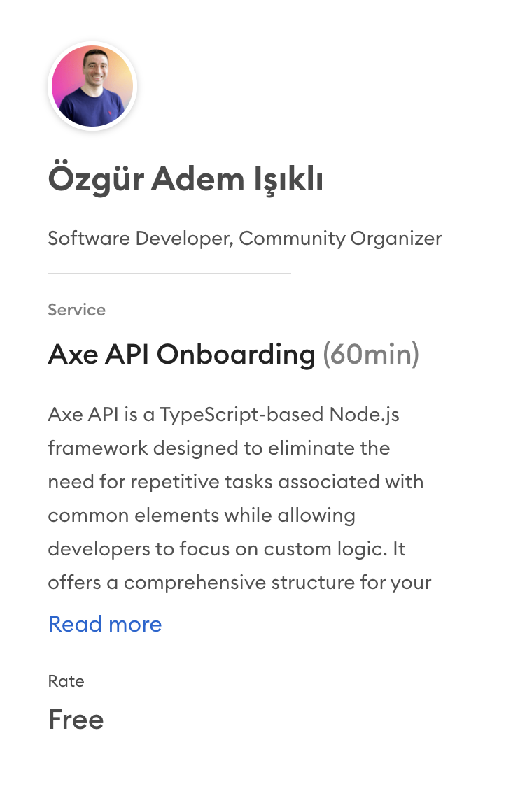

# Support

Welcome to the support page for Axe API! We're here to help you with any questions, issues, or feedback you may have. Please review the information below before reaching out for assistance.

## Getting Started

If you're new to Axe API, make sure you've checked out our documentation and [FAQs](/ecosystem/faq) for basic information and common questions. The documentation provides step-by-step guides and explanations to help you get started smoothly.

[FAQs Link](/ecosystem/faq)

## 1-1 Onboarding Meeting <Badge type="success" text="FREE" />

You can get a <b>FREE</b> onboarding meeting from the Axe API creator  (<a href="https://superpeer.com/iozguradem/-/axe-api-onboarding" target="_blank">Ozgur Isikli</a>) to bootstrap your project!

In this meeting, we can help you to create your own project with Axe API. The following topics can be discussed:

- Fundamentals of Axe API
- Understanding your project structure
- Creating your project
- Best practices
- Suggestions and pitfalls
- QA

In a one-hour meeting, we can talk about your project.

No obligation about anything!

[Book a meeting!](https://superpeer.com/iozguradem/-/axe-api-onboarding)

## Issue Tracker

If you've encountered a bug, have a feature request, or want to report an issue, please visit our [GitHub Issues](https://github.com/axe-api/axe-api/issues) page. Before submitting a new issue, search the existing issues to see if your problem has already been reported or discussed.

[Issue Tracker Link](https://github.com/axe-api/axe-api/issues)

## Chat Support

For real-time communication and quick assistance, join our chat support on [Discord](https://discord.gg/GPVNv3SZkQ). Our community members and maintainers are often available to help you with any questions you may have.

[Discord](https://discord.gg/GPVNv3SZkQ)

## Contribute

Interested in contributing to Axe API? Check out our [Contribution Guidelines](/learn/contribution.html) to learn how you can get involved, report issues, and submit pull requests.

[Contribution Guidelines](/learn/contribution.html)

## Stay Connected

Stay up-to-date with the latest news, updates, and announcements by following us on social media:

- [Twitter](https://twitter.com/axeapi)

Thank you for being a part of the Axe API community! Your feedback and contributions are invaluable to us.

Happy coding!
