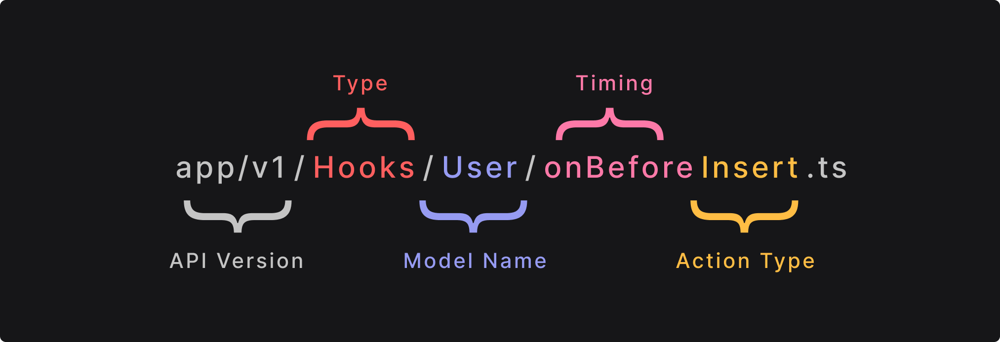
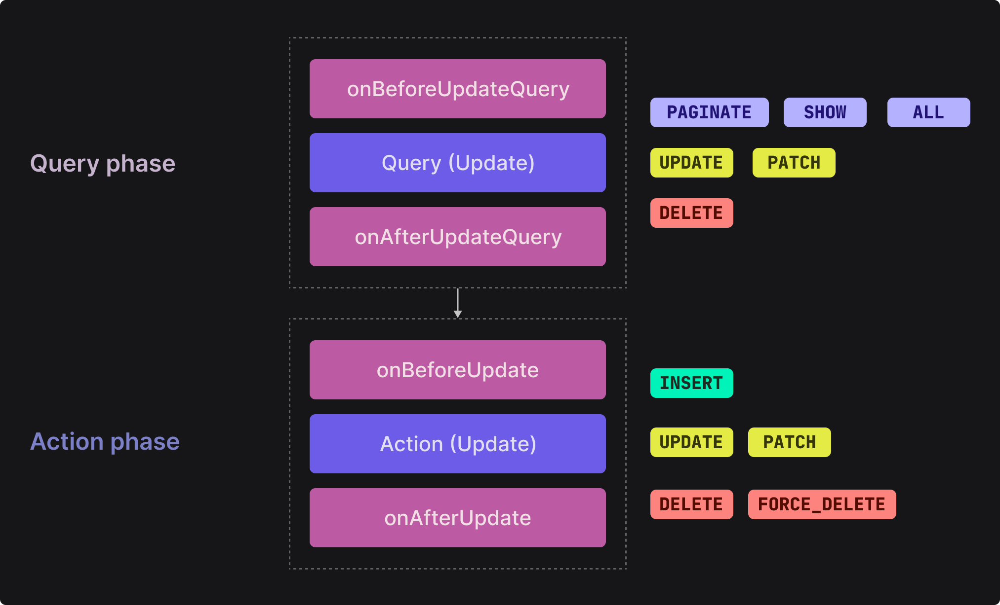

# Hooks and Events

<p class="description">
Hooks and events are a crucial part of Axe API. It allows you to add your application logic to your API in a very efficient and testable way. In this section, we will cover the logic of it.
</p>

<ul class="intro">
  <li>You will learn</li>
  <li>What are hooks and events?</li>
  <li>What is the difference between hooks and events?</li>
  <li>How to define hooks and events?</li>
  <li>How to get the HTTP Request context?</li>
</ul>

## The definition

**Hooks** and **Events** are just functions that help to attach your application logic to Axe API.

A simple _hook_ or _event_ function look like the following example;

```ts
import { IContext } from "axe-api";

export default async (context: IContext) => {
  // add your custom logic in here
};
```

As you can see, it is a very simple function. You can add _hook/event_ functions to your API, and bind them with models in the Axe API way. Once they are bonded, Axe API uses your functions during the _HTTP Request-Response cycle_.

## Hook vs. Event

You can't tell the difference between a hook function from an event function. They are completely the same. You can define `async` functions for both hooks and events.

The difference is how Axe API calls them.

In an **HTTP Request/Response cycle**, Axe API calls both hooks and events at the same time. But Axe API doesn't wait for the events as it does for **hooks**. You can check out the following example of how Axe API calls hooks and events to understand the difference;

```ts
const processHTTPRequest = async () => {
  // doing some stuffs

  // Setting the hook parameters
  const hookParameters = {};

  // Wait till the end
  await callHooks(hookParameters);

  // DO NOT wait the function
  callEvents(hookParameters);

  // doing some stuffs
};
```

The function above is just a _demonstration_ of how Axe API handles an HTTP Request in the background. As you can see, Axe API calls hooks and events with the same parameters. But it doesn't wait until the event functions are completed, unlike the hook functions.

This is the only difference between hooks and events.

## Auto-discovering

Axe API discovers your hook and event functions automatically. But you have to follow some rules. Otherwise, your functions would be ignored by Axe API.

Here are the rules;

- All hook and event functions should be placed under the `Hooks` or the `Events` folder.
- All hook and event functions should work with a model. To provide that information, your function should be placed under the exact model name. For example; `app/Hooks/User`. In this case, you should have a model named `User`.
- All hook and event function names should be described as when the function should be executed. For example; `onBeforePaginate`, `onAfterPaginate`, etc.
- All hook and event files should export the function value as the default value.

If your hook or event function doesn't apply all rules, your function would be ignored.

If you defined a valid hook or event function, Axe API executes your function at the correct time in the HTTP Request-Response cycle automatically.

The following examples demonstrate the correct hook event function definitions;

::: code-group

```ts [Hooks/User/onBeforeInsert.ts]
import { IContext } from "axe-api";

export default async (context: IContext) => {
  // This will be executed on before Insert User
};
```

```ts [Hooks/User/onAfterUpdate.ts]
import { IContext } from "axe-api";

export default async (context: IContext) => {
  // This will be executed on after Update User
};
```

```ts [Events/User/onAfterInsert.ts]
import { IContext } from "axe-api";

export default async (context: IContext) => {
  // This will be executed on after Insert User
};
```

:::

## Naming rules

Axe API executes your hook or event functions by the place name.

Let's check out the following example;



- `API Version`: This means your function will be executed in which API version.
- `Type`: Type means that your function will be executed as Hook or Event. You can put your function in the `Hooks` or the `Events` folder.
- `Model Name`: The model name means that your function will be working in which model. The model name should be exactly the same as the model name.
- `Timing`: The timing means when your function will be executed. There are two available options you can use;
  - `onBefore`: On the before the action has been executed.
  - `onAfter`: On the after the action has been executed.
- `Action Type`: The action type describes that in which action your function is related. The possible options are;
  - `Insert`: Inserting a new record.
  - `UpdateQuery`: The fetching-data that would be updated action.
  - `Update`: The action of data update.
  - `DeleteQuery`: The fetching-data that would be delete action.
  - `Delete`: The action of data delete.
  - `ForceDeleteQuery`: The fetching-data that would be force-delete action.
  - `ForceDelete`: The action of data force-delete.
  - `Paginate`: The action of data paginate.
  - `All`: The action of data fetching all.
  - `Show`: The action of fetching one item.

## `index.ts` file

As an alternative, you can use an `index.ts` file for each model that contains all of your hooks functions inside.

::: code-group

```ts [app/v1/Hooks/User/index.ts]
import { IContext } from "axe-api";

export const onBeforeInsert = async (context: IContext) => {
  // add your custom logic in here
};

export const onAfterInsert = async (context: IContext) => {
  // add your custom logic in here
};
```

:::

## HTTP Request-Response Cycle

Hook and event functions would be executed after the middlewares and the before serializer.

An HTTP Request can have two different phases by the handler types; query and action. You can use different hooks and events by handler type.



## Advantages

These kinds of functions have many advantages;

- It allows Axe API handles HTTP requests automatically instead of you.
- You can add your application logic easily to the API at the same time.
- You can write unit tests for your application logic easily because hook and event functions are completely decoupled from your API.

## Using the context

Let's assume that you will send a confirmation email to the user after a new user has been created. In this case, you can create an event function. But you need the user's email address to send the email, right?

As a developer, you will need every data that you can use in the same HTTP Request in hook and event functions. Axe API provides this information via IContext.

Let's check the following event function;

::: code-group

```ts [Events/User/onAfterInsert.ts]
import { IContext } from "axe-api";

export default async (context: IContext) => {
  // This means the created user's email
  const { email } = context.item;

  // Let's send a welcome email to the user.
  sendWelcomeEmail(email);
};
```

:::

Axe API executes the `onAfterInsert` event after a user has been created. While doing that, it passes the `IContext` to the event function. The `IContext` contains many variables that can be used by you. One of them is the `item` variable that holds the active record item by the model.

For this example, it holds the created user value. You can use the `context.item` variable to get all created user data.

## Next steps

In this section, we covered the fundamentals of hooks and events. You can find more about it in the API Reference section.

We are going to talk about serializers in the next section.
