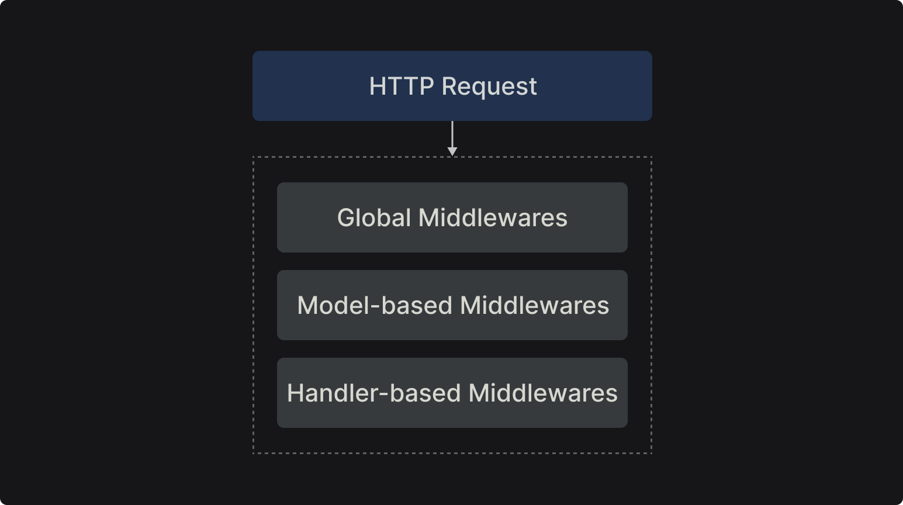

# Middlewares

<p class="description">
In this section, you are going to learn the Axe API middleware, and how you can use it in your API projects.
</p>

<ul class="intro">
  <li>You will learn</li>
  <li>What is middleware?</li>
  <li>When is middleware executed?</li>
  <li>How to create a model-based middleware?</li>
  <li>How to create a handle-based middleware?</li>
</ul>

## Middleware example

Middleware refers to software components that sit between an application's core functionality and the underlying infrastructure.

You can see a simple middleware for [connect](https://github.com/senchalabs/connect) application in the following example;

```js
const connect = require("connect");
const http = require("http");

const app = connect();

const myLogger = function (req, res, next) {
  console.log("LOGGED");
  next();
};

app.use(myLogger);

http.createServer(app).listen(3000);
```

In this example, every _HTTP_ request should be passed via the `myLogger` middleware. In that middleware, you can log the request, check the HTTP Request Headers, validate the request, etc.

Axe API middleware functions are completely the same as [connect middlewares](https://github.com/senchalabs/connect#use-middleware). Since Axe API generates HTTP routes automatically, the defining method is different, and it depends on the middleware type.

You can see the middleware schema in the following schema;



## Global middleware

In Axe API you can create a global middleware that would be executed in every HTTP request.

You should add the middleware function to your [App](/reference/app) instance in the `app/v1/init.ts` file like the following example;

::: code-group

```ts [app/v1/init.ts]
import { App } from "axe-api";
import myLogger from "./Middlewares/myLogger";

const onBeforeInit = async (app: App) => {
  app.use(myLogger);
};

const onAfterInit = async (app: App) => {};

export { onBeforeInit, onAfterInit };
```

```ts [app/Middlewares/myLogger.ts]
import { IncomingMessage, ServerResponse } from "http";
import { NextFunction } from "axe-api";

export default (
  req: IncomingMessage,
  res: ServerResponse,
  next: NextFunction,
) => {
  console.log("LOGGED");
  next();
};
```

:::

In this example, `myLogger` middleware would be executed automatically in every HTTP request that manages by Axe API.

## Model-based middleware

You can define a specific middleware for all model routes in Axe API. For example, you can define a specific logger middleware for the `User` model. In this case, all user-specific routes would call the middleware.

::: code-group

```ts [app/Models/User.ts]
import { Model } from "axe-api";
import myUserLogger from "../Middlewares/myUserLogger";

class User extends Model {
  get middlewares() {
    return [myUserLogger];
  }
}

export default User;
```

```ts [app/Middlewares/myUserLogger.ts]
import { IncomingMessage, ServerResponse } from "http";
import { NextFunction } from "axe-api";

export default (
  req: IncomingMessage,
  res: ServerResponse,
  next: NextFunction,
) => {
  console.log("USER LOGGED");
  next();
};
```

:::

:::tip
As you can see in the example above, you can define multiple middleware functions for a model.
:::

## Handler-based middleware

You can define a specific middleware for a specific model handler in Axe API. For example, you can define a specific middleware for the user pagination. In this case, the middleware would be executed for only the pagination action for the `User` model.

::: code-group

```ts [Models/User.ts]
import { Model, HandlerTypes } from "axe-api";
import { shouldBeAdmin, shouldBeLogged } from "../Middlewares";
const { INSERT, PAGINATE, UPDATE, DELETE } = HandlerTypes;

class User extends Model {
  get middlewares() {
    return [
      {
        handler: [INSERT, PAGINATE, UPDATE, DELETE],
        middleware: shouldBeLogged,
      },
      {
        handler: [DELETE],
        middleware: shouldBeAdmin,
      },
    ];
  }
}

export default User;
```

```ts [Middlewares/shouldBeLogged.ts]
import { IncomingMessage, ServerResponse } from "http";
import { NextFunction } from "axe-api";

export default (
  req: IncomingMessage,
  res: ServerResponse,
  next: NextFunction,
) => {
  console.log("Should be logged!");
  next();
};
```

```ts [Middlewares/shouldBeAdmin.ts]
import { IncomingMessage, ServerResponse } from "http";
import { NextFunction } from "axe-api";

export default (
  req: IncomingMessage,
  res: ServerResponse,
  next: NextFunction,
) => {
  console.log("Should be admin!");
  next();
};
```

:::

In this example, we added a specific middleware to specific handlers of the model.

The `shouldBeLogged` middleware will be executed for only `INSERT`, `UPDATE`, `UPDATE`, and `DELETE` handlers. But the `shouldBeAdmin` middleware will be executed for only the `DELETE` handlers.

## Next steps

In this section, the middleware structure in Axe API has been explained. You can find more in the API Reference section.

In the next section, we are going to talk about Hooks and Events.
