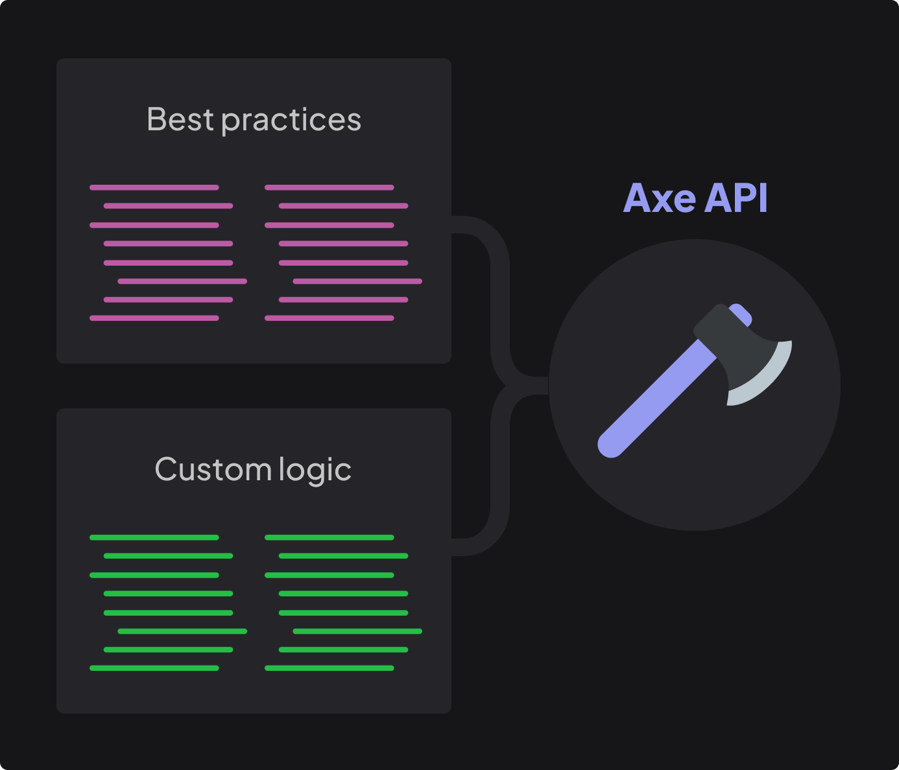

# Quick Start

<p class="description">
Welcome to the Axe API documentation! This page will give you an introduction to the 80% of Axe API concepts that you will use on a daily basis.
</p>

<ul class="intro">
  <li>You will learn</li>
  <li>What is the Axe API?</li>
  <li>How Axe API works?</li>
  <li>How to create an endpoint?</li>
  <li>How to handle an endpoint?</li>
</ul>

## Your time-saving solution

A **_Rest API_** consists of two components: **_common elements_** that require time and effort, such as best practices and shared features, and **_custom logic_** that distinguishes one API from another.



Axe API is a TypeScript-based Node.js framework designed to eliminate the need for repetitive tasks associated with common elements while allowing developers to focus on custom logic. It offers a comprehensive structure for your API, including numerous features and best practices that will save you time.

## Faster API development

Axe API simplifies the development process of your API by taking care of basic tasks such as _routing_, _validating_, _querying_, and _handling HTTP requests_.

This feature allows developers to focus on custom logic while developing their Axe API projects, which results in faster development times.

Additionally, the framework offers dedicated areas where developers can add their own custom logic.

## Model-driven API

Unlike other frameworks, Axe API doesn't require a `Controller` file. Instead, the framework focuses on your project's model files, which are the most critical aspect of the project.

Axe API automatically reads and understands your models and their relationships with each other, creating the API without any manual intervention.

Let's check out the following model;

```ts
import { Model } from "axe-api";

class Category extends Model {
  // todo...
}

export default Category;
```

Once you define your model in Axe API, the framework analyzes it and automatically creates all **CRUD** (_Create, Read, Update, Delete_) routes for you.

In addition to creating the routes, Axe API also handles all of the CRUD operations, so you don't need to do anything at all.

:::tip
Model files play a crucial role in defining your API. There are numerous features that you can specify in a model file that will determine how your API operates.
:::

## Securing data input

Security is a top priority for Axe API. To enable clients to add new records to your database table, you must specify which fields can be filled.

See the example below for reference.

```ts
import { Model } from "axe-api";

class Category extends Model {
  get fillable() {
    return ["name", "description"];
  }
}

export default Category;
```

In the provided example, the `name` and `description` fields are designated as fillable, meaning that clients can create a new record on your table by submitting an HTTP `POST` request containing these fields to your API.

## Automated validation

As a developer, it is crucial to validate all data before creating a new record in the database.

With Axe API, there is no need to write extensive code in your `Controller` file. Instead, developers should include validation rules in their model files, and Axe API handles the rest of the validation process.

```ts
import { Model } from "axe-api";

class Category extends Model {
  get fillable() {
    return ["name", "description"];
  }

  get validations() {
    return {
      name: "required|min:3|max:100",
      description: "max:100",
    };
  }
}

export default Category;
```

Axe API provides detailed error messages if a client submits invalid data in an HTTP request.

## Query your models

After defining the models for your API, your database model is immediately queryable.

For instance, you can access all the data for the **_Category_** model by using the following URL.

```bash
GET http://localhost:4000/api/v1/categories?fields=name,description
```

```json
{
  "data": [
    {
      "id": 1,
      "name": "Frameworks",
      "description": "Web application development tools."
    }
  ],
  "pagination": {
    "total": 1,
    "lastPage": 1,
    "perPage": 10,
    "currentPage": 1,
    "from": 0,
    "to": 1
  }
}
```

Axe API has built-in pagination support.

Additionally, developers can utilize various query parameters such as `fields`, `sort`, `page`, and more to obtain optimal results from the API.

## Next steps

By writing only 16 lines of code, a powerful API can be created using Axe API.

However, as this is only a demonstration, not all of the details and capabilities of Axe API were mentioned.

The next step will demonstrate how to build a real API quickly.
