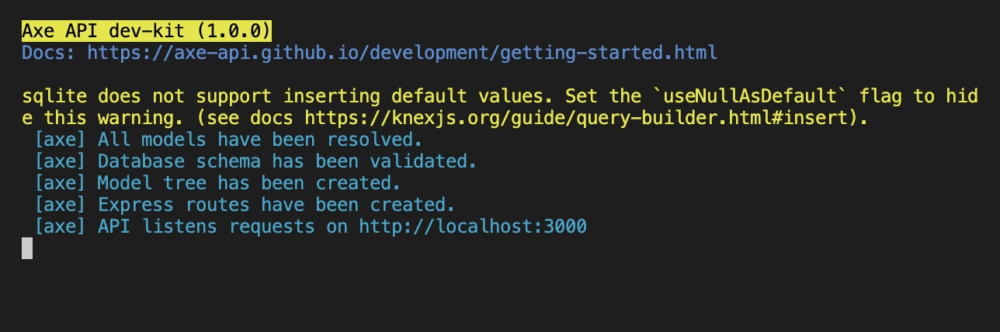

# Development Kit

<p class="description">
In this section, we will provide all the information about how you can set up your development environment.
</p>

<ul class="intro">
  <li>You will learn</li>
  <li>What is the development kit?</li>
  <li>How you can run the `axe-api` package in your machine?</li>
  <li>How to install dev-kit?</li>
</ul>

## Fork the repository

You must fork the [axe-api](https://github.com/axe-api/axe-api) repository to your GitHub account first.

:::tip
You can use the [Fork a repo](https://docs.github.com/en/get-started/quickstart/fork-a-repo) docs of GitHub.
:::

:::warning
You don't need to **fork** the repository if you are a **core team member**.
:::

## Clone repository

You can clone the repository via your command line.

```bash
$ git clone git@github.com:{GITHUB_USERNAME}/axe-api.git
```

:::warning
You should change the `{GITHUB_USERNAME}` with your GitHub username.

You can use `git@github.com:axe-api/axe-api.git` SSH URL if you are a **core team member**.
:::

## Install `dev-kit`

Axe API provides built-in `dev-kit` scripts to manage your development environment.

You can use the following command in the `root` directory of the repository you cloned.

```bash
$ npm install
$ npm i -g knex typescript ts-node-dev
$ npm run dev-kit:install
```

You should be able to see the following message in your termianl;

```bash
$ dev-kit has been installed.
```

## Run the `dev-kit`

It means that you are ready to execute the `dev-kit` in your local machine if you did not get any errors.

You can use the following command to run `dev-kit`;

```bash
$ npm run dev-kit
```

You should be able to see the following screen if everything goes correctly.



This message shows that your `dev-kit` API is running and it is ready to handle your API requests.

:::tip
Whenever you change anything in the code, your `dev-kit` application would be compiled again.
:::

## Directory Structure

The installation scripts adds some folders and files to the `axe-api` project when you install `dev-kit` to your project. These files and folders actually represent a real Rest API application that uses `axe-api`.

Let's see the following folder structure in your `axe-api` project after you installed the `dev-kit`.

```
.
├── dev-kit
  ├── app
    ├── v1
      ├── Config
      ├── Events
      ├── Hooks
      ├── Models
      ├── init.ts
      ├── config.ts
    ├── config.ts
  ├── migrations
    ├── 20210509145612_User.js
  ├── knexfile.js
  ├── mydb.sqlite
├── src
├── index.ts
├── dev-kit.ts
├── ...
```

### `index.ts`

This file is the main file of the `axe-api` package. You will need to touch this file only if you need to export more types.

### `dev-kit.ts`

This file is the initial point of `dev-kit`. This file has been executing when you run the `npm run dev-kit` command. Basically, it creates an Axe API application which is located in the `dev-kit` folder by using the `axe-api` framework files.

Usually, you don't need to change this file.

### `dev-kit` directory

In this folder, you have a Rest API structure that uses Axe API as a framework. You can change all files in this folder by your requirements.

For example; you can add a new model structure to test your Axe API changes. Your `dev-kit` application will be refreshed when you change the `dev-kit` folder.

### `src` directory

This folder contains all of the core framework codes. It means that you are working on the core structure if you are changing a file in the folder.

Your `dev-kit` application will be refreshed when you change a file in the `src` folder.

## Remove `dev-kit`

You can remove the `dev-kit` helpers whenever you want. Just execute the following command to remove `dev-kit` installation.

```bash
$ npm run dev-kit:remove
```

:::tip
All of `dev-kit` files and folders have been added to the `.gitignore` file. You don't need to delete the `dev-kit` from your repository ever. You will not send your `dev-kit` files to the main `axe-api` projects.
:::

## Next steps

In this section, we've explained what is the development kit and how you can use it.

In the following section, we are going to talk about how you can manage your development databases.
