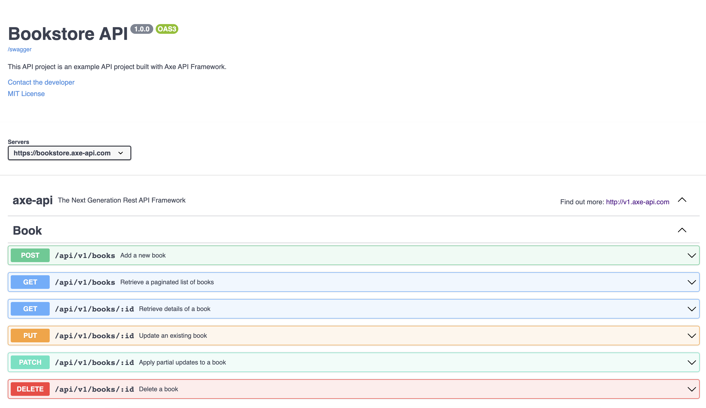

# Auto-created documentation

<p class="description">
In this section, we are going to talk about everything about API documentation and prove why Axe API is a great framework for it.
</p>

<ul class="intro">
  <li>You will learn</li>
  <li>Why documentation is important?</li>
  <li>What are the best practices?</li>
  <li>What is the Axe API approach to documentation?</li>
  <li>What API features are supported on auto-created documentation?</li>
  <li>What are the missing parts of the documentation?</li>
</ul>

## Why it is important?

API documentation is crucial as it serves as a comprehensive reference guide for developers, enabling them to understand and utilize an API effectively. It provides detailed explanations of API functionalities, endpoints, parameters, request/response formats, and authentication requirements.

Good API documentation enhances developer productivity, reduces learning curves, promotes proper API usage, and facilitates integration with other systems. Clear documentation also fosters collaboration and encourages the development of third-party applications, expanding the API's reach and potential.

Overall, API documentation is essential for seamless integration, developer satisfaction, and successful API adoption.

## Best practices

Creating API documentation involves several best practices:

- **Clear Structure**: Organize the documentation logically with sections such as introduction, endpoints, parameters, and examples. Use consistent formatting and headings.

- **Request and Response Examples**: Include sample requests and responses to illustrate how to interact with the API effectively. Cover different scenarios and provide code snippets in different ways.

- **Detailed Parameter Documentation**: Document all parameters, their types, required/optional status, and possible values. Explain their purpose with relevant examples.

- **Error Handling**: Provide a comprehensive list of error codes and their meanings. Describe how errors are returned and suggest error handling strategies for developers.

- **Versioning**: Clearly indicate the versioning scheme and how to specify the desired version in API requests.

- **Regular Updates**: Keep the documentation up to date with any changes or additions to the API. Communicate changes effectively, highlighting deprecated features and suggesting alternative approaches.

Remember, high-quality API documentation is an ongoing process that requires regular maintenance and updates to ensure its relevance and usefulness to developers.

## Auto-created API docs

There are many best practices out there to be implemented as you can see. Creating well-designed API documentation requires a lot of time and energy. But **we don't have that time and energy**. That's why we've built the Axe API framework.

Since Axe API already **_analyzes_** all of your models, routes, validations, etc, it is able to create your API documentation automatically.

Axe API supports the [OpenAPI](https://www.openapis.org) format with the [Swagger interface](https://swagger.io/docs/specification/about/).

You can see the following link a full-working example of the documentation that has been created by Axe API automatically.

[bookstore.axe-api.com/docs](https://bookstore.axe-api.com/docs)

<a href="https://bookstore.axe-api.com/docs" target="_blank" alt="Auto-created Axe API documentation">
  
</a>

## Configuration

You can decide to enable or disable the auto-documentation generation via the configuration file.

::: code-group

```ts [app/config.ts]
import { IApplicationConfig } from "axe-api";

const config: IApplicationConfig = {
  // ...
  docs: true,
  // ...
};
```

:::

## Customization

You can customize the documentation structure if you wish. Axe API uses [OpenAPI v3 specification](https://spec.openapis.org/oas/v3.1.0).

You can create a `swagger.ts` file like the following example.

::: code-group

```ts [app/swagger.ts]
export default {
  info: {
    title: "Your API Title",
    description: "Description the API in here",
  },
  servers: [
    {
      url: "https://your-api.com",
    },
  ],
};
```

:::

This file is used as the base of the documentation. **Axe API** analyzes all of your API structure and overrides the base file.

You can access the `/docs` path to see the **Swagger** documentation.

## Next step

Axe API supports powerful documentation that is created automatically by your model definitions. It is another magic of Axe API.

But this is not enough. You will learn how advanced queries you can use in the next section.
