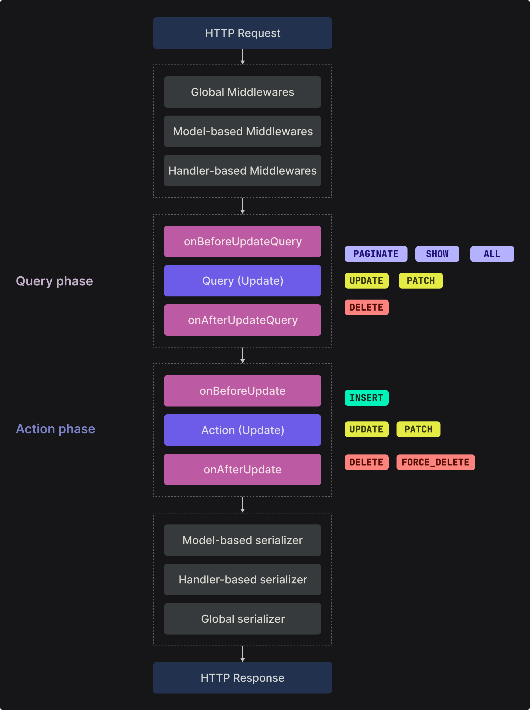

# Request-Response Cycle

In this section, we are going to talk about everything HTTP Request-Response cycle in Axe API.

<ul class="intro">
  <li>You will learn</li>
  <li>What is Request and Response?</li>
  <li>What is the Request-Response cycle?</li>
  <li>How does Axe API process the Request-Response cycle?</li>
</ul>

## Request & Response

In HTTP, a request is a client-initiated message sent to a server, specifying an action to be performed. It includes a **method** (e.g., `GET`, `POST`) and a target **URL**, optional **headers**, and sometimes a **request body**.

The server processes the request and generates a response. A response is the server's reply to the client's request, including an HTTP **status code**, **headers**, and often a **response body** containing requested data or an acknowledgment.

**Requests** and **responses** form the foundation of communication in the HTTP protocol, allowing clients to retrieve information, submit data, and interact with servers in a standardized and structured manner.

## Request-Response cycle

The **Request-Response cycle** in HTTP represents the flow of communication between a client and a server. It starts when the client sends an HTTP request to the server, specifying the desired **action**, **URL**, **headers**, and sometimes a **request body**.

The server receives the request, processes it, and generates an HTTP response. The response includes an HTTP **status code**, **headers**, and often a **response body** containing requested **data** or an acknowledgment.

When we talk about the **Request-Response cycle in Axe API**, we mean the process in that Axe API handles the request and generates a response process.

## The flow

The following schema demonstrates the Axe API Request-Response cycle for updating a resource route:

`PUT api/v1/users/1`

By the schema, we can talk about four important parts; **middleware**, **query** and **action** phases, and **serializers**.

### Middlewares

**Middleware** refers to software components that sit between an application's core functionality and the underlying infrastructure. It provides common services such as **authentication**, **logging**, and **error handling**.

Middleware acts as a bridge, enabling communication and enhancing functionality between different components in a software system.

As you can see there are different types of middleware that you can use.

### Query & Action Phases

In Axe API, each HTTP request uses **query** or **action** phases. Sometimes, both phases can be used at the same time, depending on the **handler type**.

The **Query Phase** means that database _query operations_. The **Action Phase** means _data manipulations_ like **_inserting_**, **_deleting_**, or **_updating_**.

On the right of the schema, you can see which handler support which phase.

For example, the `INSERT` handler doesn't provide the **Query Phase** because there is not anything to query before the inserting action.

Likewise, the `PAGINATE` handler doesn't provide the **Action Phase** because there is not any action (like **_inserting_**, **_deleting_**, **_updating_**) to be used.

You can use the **hooks** or the **events** at the same time during the phase (**_before_** or **_after_**) in each phase (**_Query_** or **_Action_**).

That allows you to add your application logic to the Request-Reponse cycle.

### Serializers

Serializers are functions that allow you to serialize data by your application logic. For example, you may uppercase all values, or convert item keys to `camelCase` by using a serializer function.

As you can see there are different types of serializers that you can use.

## Next step

In this section, we tried to explain the general structure of the HTTP Request-Response cycle.

In the next section, you will learn more about middleware, hooks and events, and serializers.
