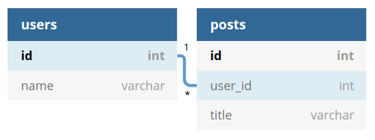
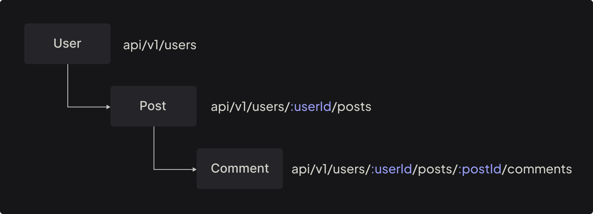

# Understanding the routing

<p class="description">
Routing is a very important topic that shaped on best-practices in the Rest API world. In this chapter, we are going to talk about route management at Axe API. 
</p>

<ul class="intro">
  <li>You will learn</li>
  <li>What is routing?</li>
  <li>How Axe API creates routes?</li>
  <li>How to manage related routes?</li>
  <li>How to enable/disable route for a specific handler?</li>
  <li>How to create custom route?</li>
</ul>

## Routing in Express.js

Routing refers to determining how an application responds to a client request to a particular endpoint.

You can see a simple [Express.js](https://expressjs.com/en/guide/routing.html) routing example in the following code block;

```js
app.get("/api/v1/users", (req, res) => {
  res.json({
    id: 1,
    // ...
  });
});
```

In the example above, a simple HTTP route is defined for the GET method. If the client sends the cURL request to the Express server, it gets the following response.

::: code-group

```bash [Request]
$ curl \
  -H "Content-Type: application/json" \
  -X GET http://localhost:3000/api/v1/users
```

```json [Response]
{
  "id": 1
  // ...
}
```

:::

In most web frameworks, developers must define all routes manually. But there are many articles on how to create a good route for a **Rest API**. If you show a _database schema_ to a developer, most of the time they can figure out more or less how routing should be.

That's why Axe API has an **auto-route creation** mechanism. Axe API core _reads_ your models, and analyzes their _relationships_, then _creates_ routes and _handles_ HTTP requests.

## Model-based routes

Let's start with fundamentals, and create a simple Axe API model;

::: code-group

```ts [User.ts]
import { Model } from "axe-api";

class User extends Model {}

export default User;
```

:::

Axe API practices the following task when you run the application;

- Analyzes `User` model
- Creates all possible routes
- Listens all created routes

For the example model, the application is ready to handle the following routes;

| HTTP Method | Route              | Description        |
| ----------- | ------------------ | ------------------ |
| `POST`      | `api/v1/users`     | Create a new item  |
| `GET`       | `api/v1/users`     | Paginate all items |
| `GET`       | `api/v1/users/:id` | Fetching an item   |
| `PUT`       | `api/v1/users/:id` | Update an item     |
| `DELETE`    | `api/v1/users/:id` | Delete an item     |

Developers don't have to create routes manually unlike other web frameworks, the only required thing is creating model files.

:::tip
Axe API uses the plural version of your model name in routes. That's why using a singular name in model names is suggested.
:::

## Model relations

Let's assume that we have some tables that are related to each other, like the following example;



You can define a relationship between models to create related routes;

::: code-group

```ts {5} [User.ts]
import { Model } from "axe-api";

class User extends Model {
  posts() {
    return this.hasMany("Post", "id", "user_id");
  }
}

export default User;
```

```ts {5} [Post.ts]
import { Model } from "axe-api";

class Post extends Model {
  user() {
    return this.belongsTo("User", "user_id", "id");
  }
}

export default Post;
```

:::

We defined two models; `User` and `Post`.

In the `User` model, we defined a `hasMany` relationship. By that definition, we aim to create a relation from the `User` model to the `Post` model. Which means that every **_user_** might have many **_posts_**.

In the `Post` model, we defined a `belongsTo` relationship. This means every **_post_** might have only one related **_user_** record.

Axe API creates automatically the following routes by this model definition;

| HTTP Method | Url                              | Description         |
| ----------- | -------------------------------- | ------------------- |
| `GET`       | `api/v1/users`                   | Paginate users      |
| `POST`      | `api/v1/users`                   | Create a new user   |
| `GET`       | `api/v1/users/:id`               | Get a user by id    |
| `PUT`       | `api/v1/users/:id`               | Update a user by id |
| `DELETE`    | `api/v1/users/:id`               | Delete a user by id |
| `GET`       | `api/v1/users/:userId/posts`     | Paginate posts      |
| `POST`      | `api/v1/users/:userId/posts`     | Create a new post   |
| `GET`       | `api/v1/users/:userId/posts/:id` | Get a post by id    |
| `PUT`       | `api/v1/users/:userId/posts/:id` | Update a post by id |
| `DELETE`    | `api/v1/users/:userId/posts/:id` | Delete a post by id |

## Select the relation name

In a model file, you can override the base Axe API model's getters.

All functions other than getters that are defined in a model file would be accepted as a **_relationship definition_**. In the creating relation route process, the function name would be used in the route definition.

Let's look at the following definition;

::: code-group

```ts {4} [User.ts]
import { Model } from "axe-api";

class User extends Model {
  tasks() {
    return this.hasMany("Task", "id", "created_user_id");
  }
}
```

:::

By this definition, the route name will be generated as `api/v1/users/:userId/tasks`. As you can see, the function name is used directly in the route.

Let's assume that we create two relationship functions for the same child model, with different names;

::: code-group

```ts {4,8} [User.ts]
import { Model } from "axe-api";

class User extends Model {
  createdTasks() {
    return this.hasMany("Task", "id", "created_user_id");
  }

  assignedTasks() {
    return this.hasMany("Task", "id", "assigned_user_id");
  }
}
```

:::

In this example, Axe API creates the following route structures;

| Route structure                           | Model  | Foreign key        |
| ----------------------------------------- | ------ | ------------------ |
| `api/v1/users/:id`                        | `User` |                    |
| `api/v1/users/:userId/created-tasks/:id`  | `Task` | `created_user_id`  |
| `api/v1/users/:userId/assigned-tasks/:id` | `Task` | `assigned_user_id` |

As you can see, Axe API uses the function name by converting it to `param-case`.

## Route tree structure

It is important to understand that Axe API creates a route tree by relationship definitions.

If a model (let's call it as `User`) has a `has-many` relationship (let's assume to the `Post` model), which means that that model (`User`) will be top of the three (`/api/v1/users/:id/posts`).

Also, the `Comment` model would be the child of the `Post` model if you defined it as a `hasMany` relationship in the `Post` model.

Let's check the following model relations;

::: code-group

```ts {4} [User.ts]
import { Model } from "axe-api";

class User extends Model {
  posts() {
    return this.hasMany("Post", "id", "user_id");
  }
}

export default User;
```

```ts {4,8} [Post.ts]
import { Model } from "axe-api";

class Post extends Model {
  user() {
    return this.belongsTo("User", "user_id", "id");
  }

  comments() {
    return this.hasMany("Comment", "id", "post_id");
  }
}

export default Post;
```

```ts {4} [Comment.ts]
import { Model } from "axe-api";

class Comment extends Model {
  post() {
    return this.belongsTo("Post", "post_id", "id");
  }
}

export default Comment;
```

:::

Your **_model tree_** would be like the following schema by your relationship definitions.



As a general rule, the models that have not been defined in a `has-many` relationship by other models would be on the top level.

## Adding a custom route

Axe API allows you to define custom routes in the `app/v1/init.ts`.

::: code-group

```ts [app/v1/init.ts]
import { App } from "axe-api";

const onBeforeInit = async (app: App) => {
  app.get("/api/health", (req, res) => {
    res.json({
      status: true,
    });
  });
};

const onAfterInit = async (app: App) => {};

export { onBeforeInit, onAfterInit };
```

:::

By using the initialization file, you can create very specific routes, to implement your custom logic.

## What is `HandlerTypes`?

`HandlerTypes` is a specific name of a route to describe the request. Because using HTTP Method doesn't describe clearly the aim of an HTTP request.

For example, an HTTP `GET` request might aim to fetch a single data, or paginate all items. `HandlerTypes` in the Axe API ecosystem describes the **_aim of the HTTP request_**.

Let's check the following table;

| HTTP Method | Route                    | HandlerTypes   | Description          |
| ----------- | ------------------------ | -------------- | -------------------- |
| `POST`      | `api/v1/users`           | `INSERT`       | Create new item      |
| `GET`       | `api/v1/users`           | `PAGINATE`     | Paginate items       |
| `GET`       | `api/v1/users/all`       | `ALL`          | Fetch all items      |
| `GET`       | `api/v1/users/:id`       | `SHOW`         | Fetch an item        |
| `PUT`       | `api/v1/users/:id`       | `UPDATE`       | Update an item       |
| `PATCH`     | `api/v1/users/:id`       | `PATCH`        | Patch an item        |
| `DELETE`    | `api/v1/users/:id`       | `DELETE`       | Delete an item       |
| `DELETE`    | `api/v1/users/:id/force` | `FORCE_DELETE` | Force delete an item |

A `HandlerTypes` is the name of a specific HTTP request.

You can define which `HandlerTypes` should be used to create automatic routes in an model.

::: code-group

```ts [User.ts]
import { Model, HandlerTypes } from "axe-api";

class User extends Model {
  get handlers() {
    return [HandlerTypes.PAGINATE];
  }
}

export default User;
```

:::

By this definition, the only HTTP route that will be created is the following one;

| HTTP Method | Route          | Description        |
| ----------- | -------------- | ------------------ |
| `GET`       | `api/v1/users` | Paginate all items |

You can decide what handlers should be created by using the model definition.

## Next step

In this section, we tried to explain the fundamentals of routing. Next section, we are going to talk about version management.
