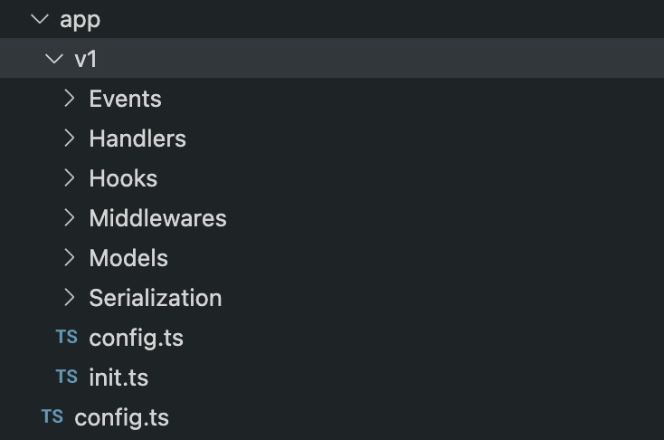

# Version management

Version management is critical to delivering a robust API that will be minimally impacted by changes. In this section, we are going to talk about how you can manage your APIs versions.

<ul class="intro">
  <li>You will learn</li>
  <li>What is an API version?</li>
  <li>How to create an API version?</li>
  <li>How to to select the correct API version?</li>
  <li>Which features can be changed for each version?</li>
</ul>

## Fundamentals

Each API changes over time as new features are added or removed. As there can be many different applications that use an API, these applications are usually updated after the API change.

Therefore, understanding and configuring API changes is an important issue.

Changes can be grouped into 3 groups:

- `patch`
- `minor` changes
- `major` changes

The `patch` and `minor` changes are not important for clients using the API. Such changes consist of either a bug fix or the addition of a new feature, and they will not cause existing clients to malfunction.

On the other hand, `major` changes are critical. Such changes cause the clients to malfunction or require some changes in the clients.

Version management is performed only for major changes in the API development process. For `patch` and `minor` changes, the version is not determined. That's why we don't see an API version like `1.0.0`.

Instead, API versions usually consist of major version versions such as `v1` or `v2`.

## Default API version

When you create a new Ax API project, it creates a new API project with version `v1`.

In an Ax API project, version management is provided by folder naming. Each version is located under its own folder.

Each version folder contains its own API configuration. In this way, a specific configuration for each version, model files, model configurations, `events` and `hooks`, etc. you can use.

## Selecting the version

While Axe API creates routes, it adds the version number to the URL.

For example;

`api/v1/users`

This URL means that;

- `api`: The general API prefix. It can be changed via the `config.ts`.
- `v1`: The version folder name. It can be changed via the folder name.
- `users`: The model's URL. It can be changed by the model file name.

HTTP clients should send the URL version in the URL. For different versions, clients should send the correct version in the URL.

## Creating a new version

To create a new version, you must copy the latest version of your API, and give it a new name.

By the best practices, we strongly suggest the following version numerations;

- `v1`
- `v2`
- `v3`

You must keep in your mind that you should create a new version only if you change something that doesn't work on client request.

For example; adding a new model is not a **_braking change_**. On the other hand, deleting a model is a breaking change because in that case, HTTP clients can't work until they change their code.

## Next step

In this section, we've explained how you can manage versions in an Axe API project. The next chapter is about validating user data.
